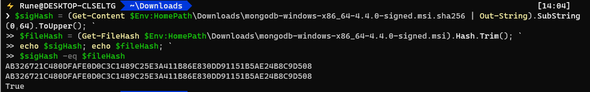
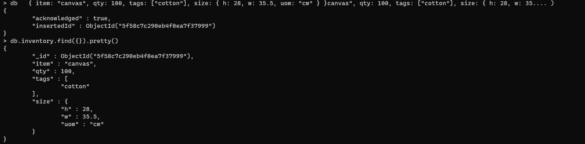
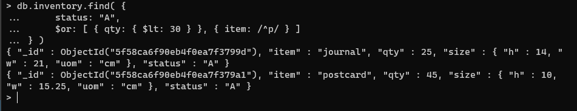
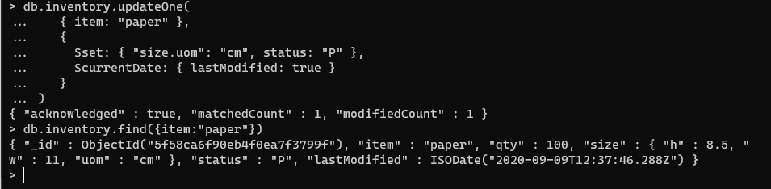
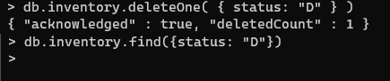
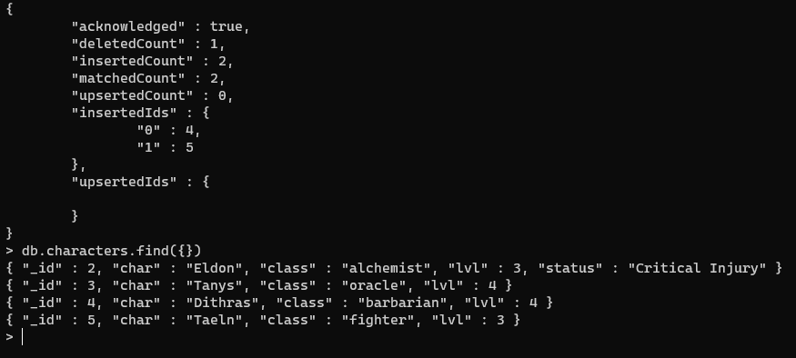
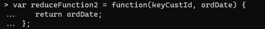
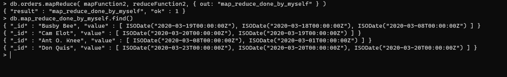

# Software Technology Experiment 3

# Technical issues

I had no technical issues during this exercise. The installation of mongoDB went smoothly and all opperations done during the different subtasks all worked first try. 

  

# Screenshots

Validation of download:

  

**### Experiment 1**

---

Insert Document in database:

Querying documents:

Update documents:

Deleting documents:

Bulk write operations (screenshot taken after running the given code from example):

  

### Experiment 2

---
Using this map function: (therer should be a ';' after the end '}')

and this reduce function:

I got this output:

Here i have mapped each orderdate to the cust_id of each customer. As of why it's useful is a matter of opinion, because all data is useful in some way. I decided to do it like this beacuse i never used this technology before and it was a good way to understand how it worked. This output could be very useful for a store to know how often a customer buys anything at the store. 

  

# Pending issues

No pending issues as mongoDB was very friendly to use on Windows.