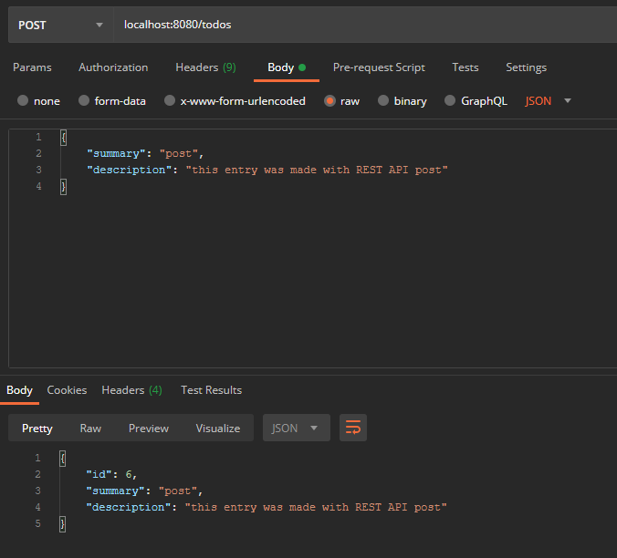

# Software Technology Experiment 4

My code is found [here](https://github.com/runalmaas/dat250-sparkjava-REST).

## Experiment 1

After cloning the repo and running ```App.java``` I opened a browser with the URL localhost:8080/counters and it displayed ```{"red":3,"green":5}```.

In Postamn I did the following:


## Experiment 2

I copied the skeleton from [Experiment 1](#experiment-1) and added my own implementations for GET, PUT, POST and DELETE.


The CUD operations needs a body for the information they need to create, update or delete a entry in the database. While the GET operation is fixed to a hierarchical information space. Example: /todos/1 will return the entry with primary key 1 if it exists, /todos/2 will return the entry with PK 2 if it exists and so on.

I used postman to see if my implementation worked and got the following outputs for the CRUD operations.

POST:



GET:


PUT:


DELETE:


First I created a Todo object with ID 6 using POST. Then I fetched it with GET. Then I updated it with PUT. Then I deleted it with DELETE. 

I used JPA and derby to store the todo objects.

# Technical issues

When I tried to use GET from Postman i got this error in my IDE:


and this error in Postman:


The exact same thing happened when I tried the PUT function in Postman. When I used the classes from Intellij ```GetRequest.java``` and ```PutRequest.java``` they work just fine:


This got fixed by downloading Postman desktop agent.
