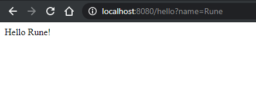
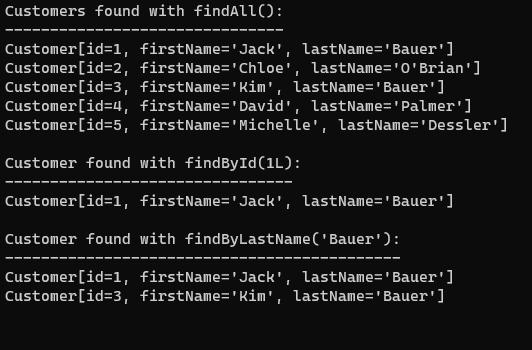

# Software Technology Experiment Assignment 5

Everything I did in these tutorials work flawlessly, as I had java and maven installed from previous Software Techonnlogy Experiments it was all just "plug and play". I got no technical issues nor have any pending issues.

My code for experiment 1-4 can be found here: https://github.com/runalmaas/Software-Technology-Experiments/tree/master/Spring

# Experiment 1: Getting started

After downloading the spring project and adding this code:

```Java

package com.example.demo;
import org.springframework.boot.SpringApplication;
import org.springframework.boot.autoconfigure.SpringBootApplication;
import org.springframework.web.bind.annotation.GetMapping;
import org.springframework.web.bind.annotation.RequestParam;
import org.springframework.web.bind.annotation.RestController;
              
@SpringBootApplication
@RestController
public class DemoApplication {
                
                  
    public static void main(String[] args) {
        SpringApplication.run(DemoApplication.class, args);
    }
                  
    @GetMapping("/hello")
    public String hello(@RequestParam(value = "name", defaultValue = "World") String name) {
        return String.format("Hello %s!", name);
    }
                
}
```

followed by runnning 

```console
> mvn spring-boot:run
```


I had a working end point at http://localhost:8080/hello.


<br><br>

# Experiment 2: Spring Boot

I followed the guide and was prompted with this message after the initial curl call in the terminal:


further following the guide to the point **Add production-grade Services** i got this output from the curl command:


<br><br>

# Experiment 3: REST service

There was not very much to this experiment.

I added:
```Java
package com.example.restservice;

public class Greeting {

	private final long id;
	private final String content;

	public Greeting(long id, String content) {
		this.id = id;
		this.content = content;
	}

	public long getId() {
		return id;
	}

	public String getContent() {
		return content;
	}
}
```

and this:
```Java
package com.example.restservice;

import java.util.concurrent.atomic.AtomicLong;

import org.springframework.web.bind.annotation.GetMapping;
import org.springframework.web.bind.annotation.RequestParam;
import org.springframework.web.bind.annotation.RestController;

@RestController
public class GreetingController {

	private static final String template = "Hello, %s!";
	private final AtomicLong counter = new AtomicLong();

	@GetMapping("/greeting")
	public Greeting greeting(@RequestParam(value = "name", defaultValue = "World") String name) {
		return new Greeting(counter.incrementAndGet(), String.format(template, name));
	}
}
```

ran the build with maven and followed the **Test the Service** points.


# Experiment 4: Data Access

Following the guide and running the command 
```console
 > mvn spring-boot:run
 ```

I got this output:



