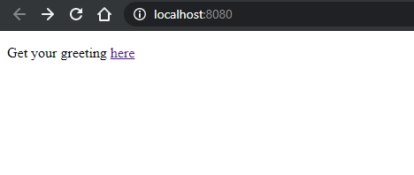
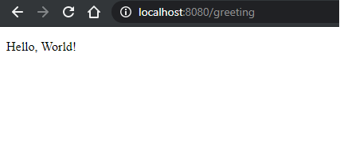
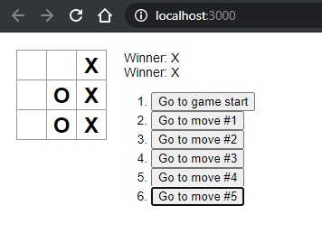

# Software Technology Experiment 6

This experiment gave a introduction to React and forntend development in spring boot. I had no problems with setup or following the guides.

My code can be found here:

Experiment 1: https://github.com/runalmaas/Software-Technology-Experiments/tree/master/Spring/serving-web-content

Experiment 2: https://github.com/runalmaas/Software-Technology-Experiments/tree/master/React/my-app

## Experiment 1

After following the guide and runnig the code I got welcomed by this page.

The "here" link directed me to this page.

## Experiment 2

Following the guide I ended up with a website that ran both localy on my computer and on other computer connected to the same network as me.

The site was a baisc tic-tac-toe game with a step history function.

