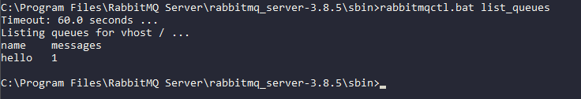
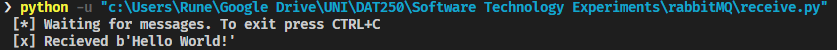
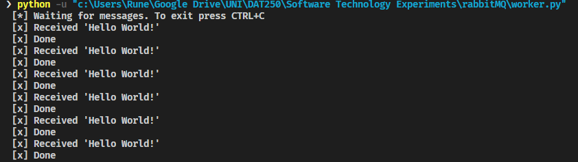
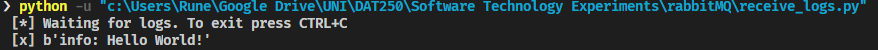

# Software Technology Experiment 7

This experiments gave an introduction to RabbitMQ and messaging systems. This included a basic "hello world!" of messaging, worker queues and Publish/Subscrib. I had no technical difficulties during the installation of RabbitMQ or the tutorials. 

## Experiment 2: Hello World

Following the guide to the end of the sender part it is expected that a queue with the name "hello" have one or more massages in it. In my case this was correct:



Continuing and finnishing the reveiver file and runnning both sender and receiver i got this message from receiver:




<br><br>
## Experiment 3: Queue messaging

Writing the code for both ```new_task``` and ```worker``` followed by running them both produced this:



Note that i did run ```new_task``` several times.


<br><br>
## Experiment 4: Topics

Same as previous experiemnts I ran the code after finnishing both ```emit_log``` and ```receive_logs``` and got an output like this:


